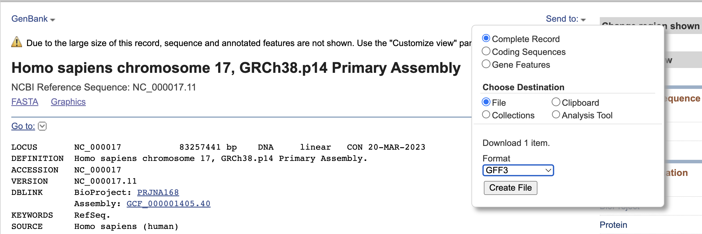

## Setting Up The Analysis Directory

To begin we will need a space to work, let's create a directory to house all of our input data, scripts and results:

```sh
mkdir rna_seq_pipeline
cd rna_seq_pipeline
```

Now let's make subfolders for our data, scripts and results:

```sh
mkdir data
mkdir tools
mkdir qc_output
mkdir trimmed_output
mkdir star_index
mkdir alignment_output
mkdir featurecounts_output
```


## Creating A Conda Environment

For reproducible research it is advisable to keep the software versions you use consistent. An easy way of ensuring this is by creating a Conda environment. For more information on how to build conda environments check out:

!!! info "[Conda Environments](../../../programming_languages_tools/conda/conda_environment.md)"

Here, we will enter our tools directory and create a conda environment from the following yml file:

```sh
cd tools
wget https://raw.githubusercontent.com/BioNomad/omicsTrain/main/docs/omics/transcriptomics/bulk_rna_seq/data/rnaseq_environment.yml
```

Now, let's create the environment and activate it!

```sh
conda env create -f rnaseq_environment.yml    # create conda environment
source activate rnaseq                        # activate conda environment
cd ..                                         # leave tools directory
```

## Downloading Fastq Read Data

Today we will be working with data from [Srinivasan et al. 2020](https://www.ncbi.nlm.nih.gov/pmc/articles/PMC7422733/) where they assessed transcriptional changes in patients with and without Alzheimer's disease. Let's create an accession list to download a few files from this study:

```sh
cd data
nano accList.txt
```

!!! info "accList.txt"

    ```sh
    SRR8440545
    SRR8440550
    SRR8440537
    SRR8440481
    ```

Now we will need meta data for these samples. The following data was taken from the [SRA Run Selector](https://www.ncbi.nlm.nih.gov/Traces/study/?acc=PRJNA515044&o=acc_s%3Aa). SRA, or sequence read archive, is a public repository for sequence data which we are pulling from for this analysis.

```sh
nano meta.txt
```

!!! info "meta.txt"

    ```sh
    ID	Diagnosis	Age	Sex
    SRR8440545  	Control	53	male
    SRR8440550  	Control	81	male
    SRR8440537 	AD	74	female
    SRR8440481  	AD	79	male
    ```

Before we can download our data we will need to configure the sra-toolkit with the following command:

```sh
vdb-config -i
```

Click `X` and you are finished configuring! To download the sequence data we will use the following command:

```sh
fastq-dump -N 100000 -X 200000  --skip-technical --split-3 --clip --gzip  $(<./accList.txt)
```

!!! example "Explanation of Terms"

    - `-N` start at read 100000
    - `-X` end at read 200000
    - `--skip-technical` skip technical reads and only download biological reads
    - `--split-3` split paired end data
    - `--clip` remove adapters
    - `--gzip` compress the output
    

## Download Reference Data

Now to actually figure out what genes are expressed we need some sort of reference to map our reads too. We will be using the following reference:

!!! info "[Homo sapiens chromosome 17, GRCh38.p14 Primary Assembly](https://www.ncbi.nlm.nih.gov/nuccore/NC_000017.11)"

To download the fasta file complete the following steps:

1. Go to [Homo sapiens chromosome 17, GRCh38.p14 Primary Assembly](https://www.ncbi.nlm.nih.gov/nuccore/NC_000017.11)
2. Click `Send To`
3. Click `File`
4. Change the format to `FASTA`
5. Click `Create File`
6. Move the downloaded file to the `rna_seq_pipeline/data` folder


!!! info "Downloading the Reference FASTA File"

    
    
To download the gff3 file complete the following steps:

1. Go to [Homo sapiens chromosome 17, GRCh38.p14 Primary Assembly](https://www.ncbi.nlm.nih.gov/nuccore/NC_000017.11)
2. Click `Send To`
3. Click `File`
4. Change the format to `GFF3`
5. Click `Create File`
6. Move the downloaded file to the `rna_seq_pipeline/data` folder

!!! info "Downloading the Reference GFF3 File"

    
    
    

## References

1. [Alzheimer’s Patient Microglia Exhibit Enhanced Aging and Unique Transcriptional Activation](https://www.ncbi.nlm.nih.gov/pmc/articles/PMC7422733/)
2. [Homo sapiens chromosome 17, GRCh38.p14 Primary Assembly](https://www.ncbi.nlm.nih.gov/nuccore/NC_000017.11)
