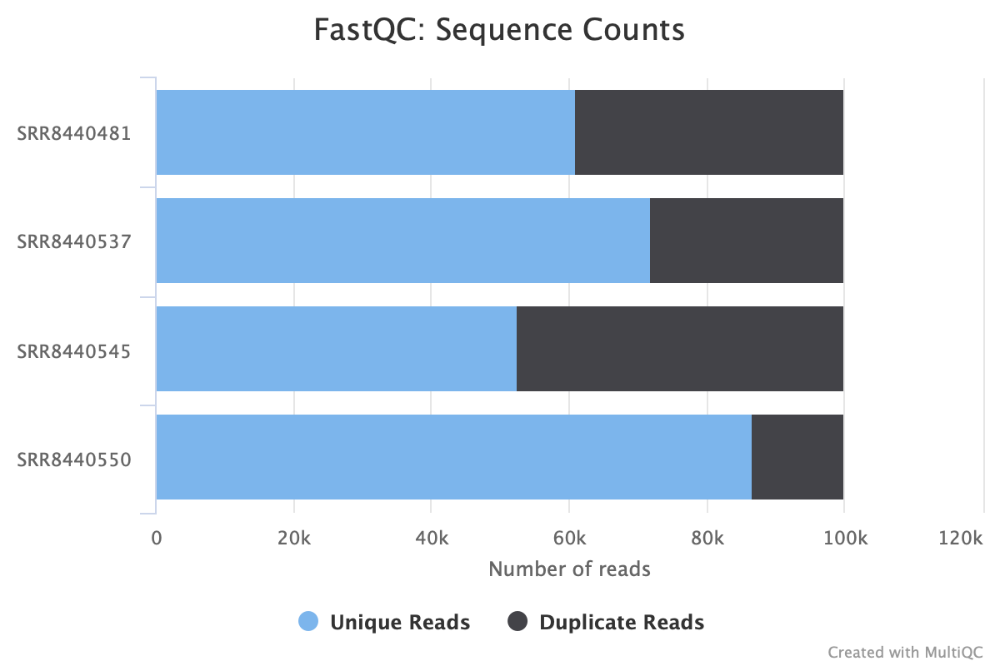
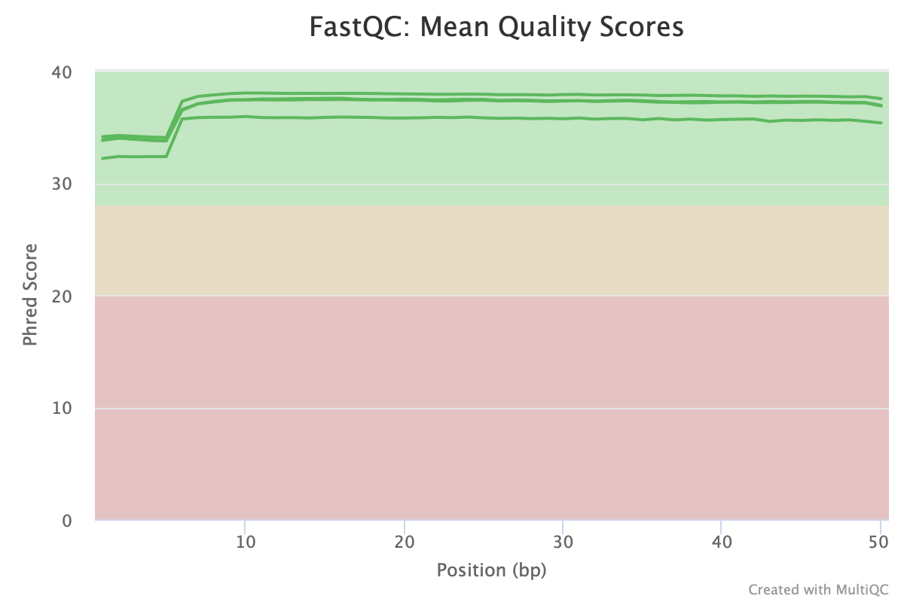
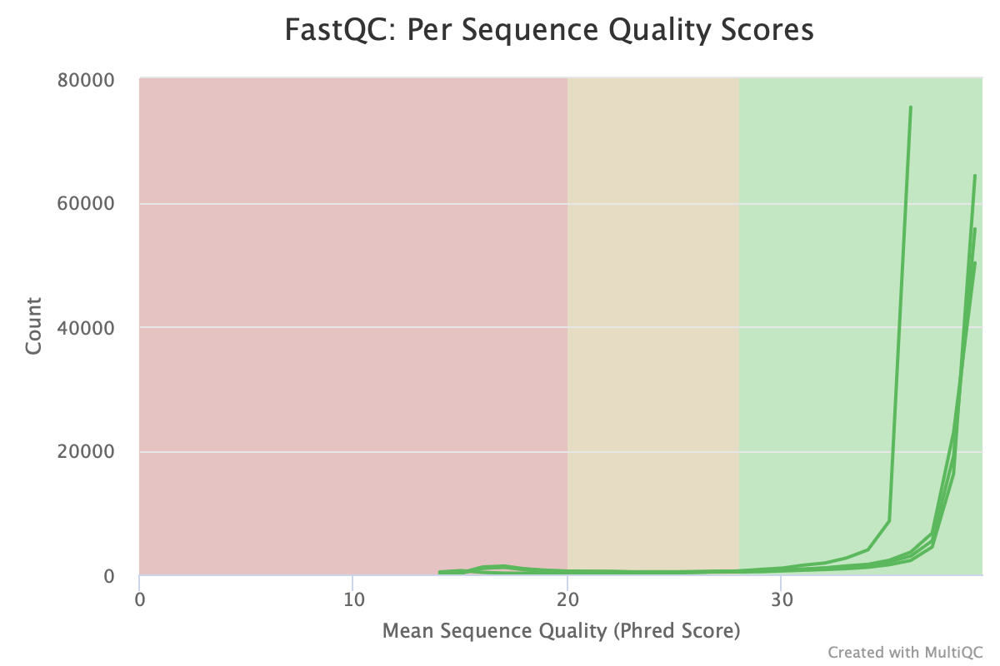
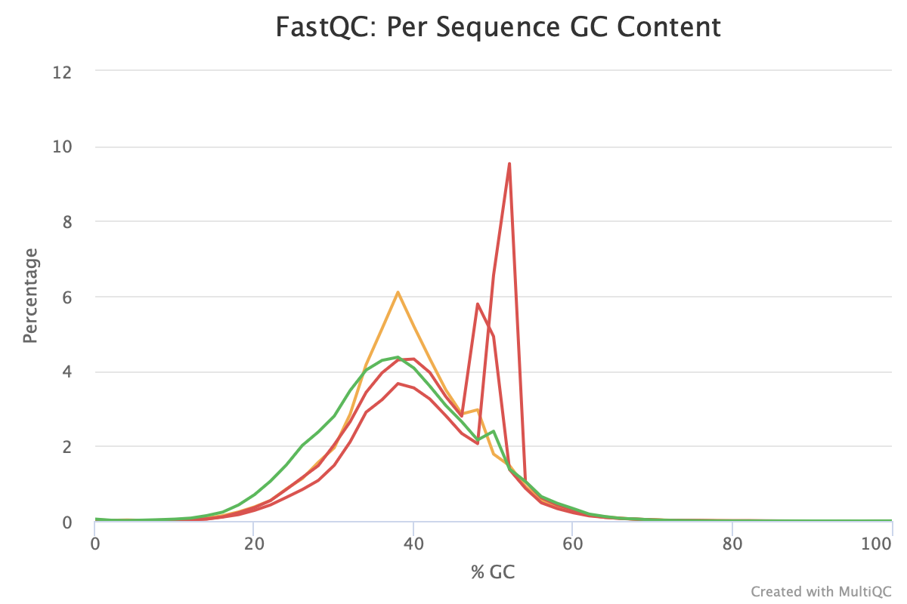
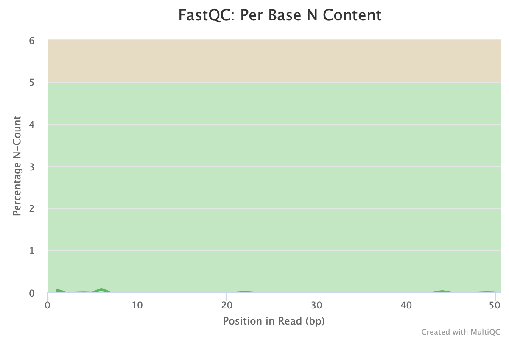
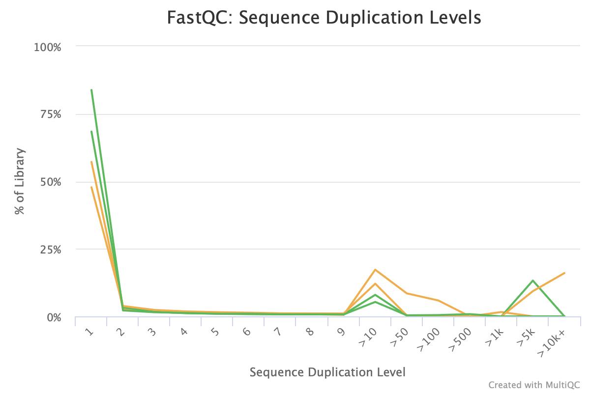
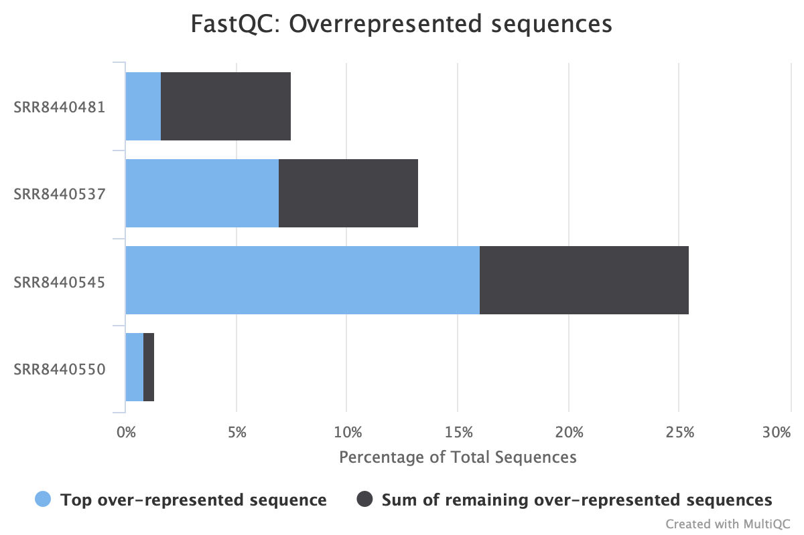
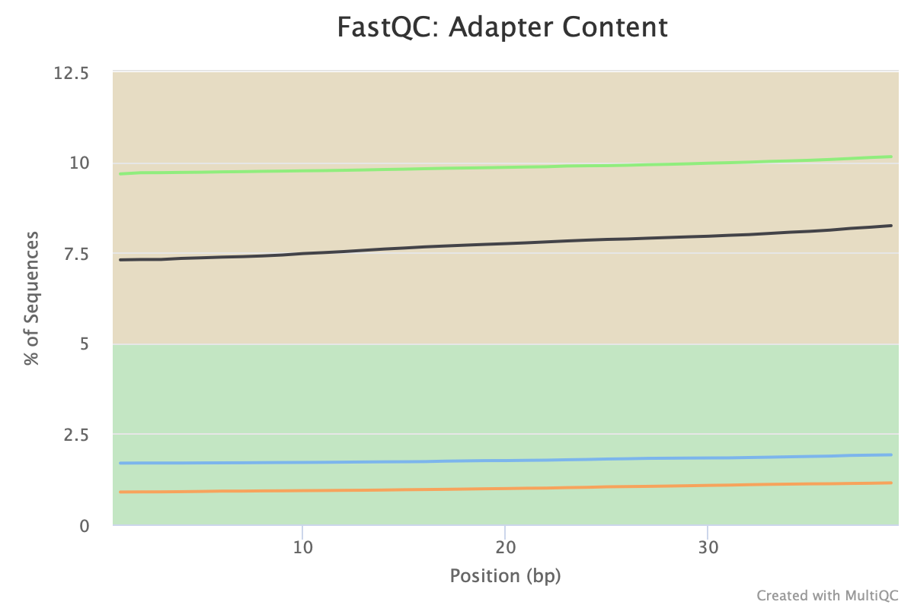

## FASTQ Format

The sequencing data we will be looking at is composed of reads, or short nucleotide sequences. Read information is stored in FASTQ files:

!!! info "[FASTQ Format](https://www.drive5.com/usearch/manual7/fastq_files.html)"

    
   
   
Here we see that for each read there are four lines:

- sequence label
- nucleotide sequence
- a separator
- quality score string

## Quality Scores

Quality scores are a score representing the probability that a base was called in error. A common score used is the Phred Score:

|Phred Quality Score	|Probability of incorrect base call	|Base call accuracy|
|-|-|-|
|10	|1 in 10|	90%|
|20	|1 in 100|	99%|
|30	|1 in 1000|	99.9%|
|40	|1 in 10,000|	99.99%|
|50	|1 in 100,000|	99.999%|
|60	|1 in 1,000,000|	99.9999%|

Typically, we would like the bases in our sequence to have a quality score higher than 20, meaning that there was a 1 in 100 chance the base was called in error.

## Quality Control

To check quality scores (and a few other metrics), we can use a tool called FastQC. Let's make a script:

```sh
nano initial_qc.sh
```

!!! info "inital_qc.sh"

    ```sh
    #!/bin/bash
        
    # Step 1: Perform quality control using FastQC
    mkdir qc_output/initial_qc
    fastqc -o qc_output/initial_qc/ data/*.fastq.gz
        
    # Step 2: Aggregate quality control results using MultiQC
    multiqc qc_output/initial_qc -o qc_output/initial_qc --title "Raw Data QC Report"
        
    echo "Initial Quality Control Comlete!"
    ```

To check out the intial quality control report go to `qc_output/initial_qc/` and open the file `Raw-Data-QC-Report_multiqc_report.html`. Here you will see a number of plots:

!!! info "General Statistics: columns for samples, the percent of duplicated sequences, gc content, number of sequences (in million) per sample"

    

!!! info "Sequence Counts: Sequence counts for each sample. Duplicate read counts are an estimate only."

    
    
!!! info "Sequence Quality Histograms: The mean quality value across each base position in the read."

    
    
!!! info "Per Sequence Quality Scores: The number of reads with average quality scores. Shows if a subset of reads has poor quality."

    
    
!!! info "Per Sequence GC Content: The average GC content of reads. Normal random library typically have a roughly normal distribution of GC content."

    
    
!!! info "Per Base N Content: The percentage of base calls at each position for which an N was called."

    
    
!!! info "Sequence Duplication Levels: The relative level of duplication found for every sequence. "

    

!!! info "Overrepresented sequences: The total amount of overrepresented sequences found in each library."

    
    
!!! info "Adapter Content: The cumulative percentage count of the proportion of your library which has seen each of the adapter sequences at each position."

    
    
In the above plots we note that we have a number of duplicated/overrepresented reads. This is to be expected with RNA-seq data as there could be more than one copy of a transcript present. We can also see that the quality of the reads is quite good, with most bases having an average quality score of at least 30. In the Per Sequence GC Content plot, we expect to see that sequences in a sample have a roughly normal distribution of GC content. GC content can be a way to assess the presenece of more than one organism given that different organisms have different GC content percentages. However this is to be expeceted, since this is RNA-seq data, and different transcripts will have different levels of GC content. We can also see slight spikes in the Per Base N Content plot. N's are inserted during base calling when the sequencer can determine a base is present, but cannot determine _which_ base is present. Finally, we note that there are adapters present in our data, specifically the Illumina Universal Adapter. These need to be removed as they do not represent biological sequences. 

## Read Trimming

To remove poor quality sequences or adapter sequences we need a tool that can _trim_ these sequences to only keep the highly quality ones. We can use the tool Trim-Galore to do just that. Let's create a script to trim our fastq sequences and perform QC on them:

!!! info "trimming.sh"

    ```sh
    #!/bin/bash
    
    # Step 3: Trim data using Trim Galore
    mkdir qc_output/trimmed_qc
    for file in ./data/*.fastq.gz; do
        trim_galore --output_dir ./trimmed_output $file --fastqc --fastqc_args "-o ./qc_output/trimmed_qc"
    done

    # quality control on trimmed
    multiqc qc_output/trimmed_qc -o qc_output/trimmed_qc/ --title "Trimmed Data QC Report" 
    
    echo "Input Data Has Been Trimmed!"
    ```
    
To confirm that the adapters are gone, check the file `Trimmed-Data-QC-Report_multiqc_report.html`! There you should note that the no samples were found with any adapter contamination above 0.1%.
    
## References

1. [Base-Calling of Automated Sequencer Traces Using Phred. II. Error Probabilities](https://genome.cshlp.org/content/8/3/186.full)
2. [Quality Control](https://training.galaxyproject.org/training-material/topics/sequence-analysis/tutorials/quality-control/tutorial.html)
3. [FastQC](https://www.bioinformatics.babraham.ac.uk/projects/fastqc/)
4. [MultiQC](https://multiqc.info/)
5. [Trim-Galore](https://www.bioinformatics.babraham.ac.uk/projects/trim_galore/)
