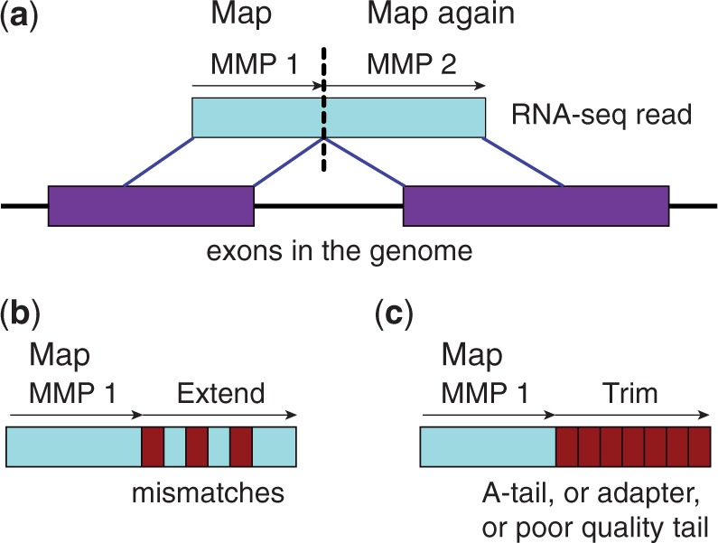

## Read Alignment with STAR

Now that our reads are trimmed and we are left with high quality biological sequences we can try to map them back to the genome of the organism we sampled. A popular choice of aligner is STAR or Spliced Transcripts Alignment to a Reference. STAR works by finding something called a Maximal Mappable Prefix (MMP) or the longest part of a read that matches a reference sequence. STAR is splice aware in that when it cannot be mapped contiguously to a genome (like in that case where the MMP maps to an exon and and intron!) the next MMP will be identified and will be mapped to only an acceptor splice site! This MMP, when failing to reach the end of a read, will be extended till it can find regions that do match - allowing for mismatches and indels:


!!! info "STAR: ultrafast universal RNA-seq aligner"

    
    
## Building an Index

Before we can map our reads we need to index our genome, in order to determine order sequence information in such a way to speed up alignment:

```sh
nano index.sh
```

!!! info "index.sh"

    ```sh
    #!/bin/bash
    
    # Step 4: Index the reference genome using STAR
    STAR --runMode genomeGenerate \
    --genomeDir star_index/ \
    --genomeFastaFiles data/sequence.fasta
    ```

!!! example "Explanation of Terms"

    - `--runMode genomeGenerate` generate genome index
    - `--genomeDir star_index/` path to the STAR index
    - `--genomeFastaFiles data/sequence.fasta` path to the reference FASTA file
    
## Gene Annotation

The choice of annotation is very important when aligning sequencing! Different gene annotation sources will have different coordinates for genes (also called features):

- **[GENECODE](https://www.gencodegenes.org/):** advisable for well annotated species (e.g. human/mouse) as this annotation source aims to classify all gene features
- **[UCSC](https://genome.ucsc.edu/cgi-bin/hgGateway) or [ENSEMBL](http://www.ensembl.org/index.html?redirect=no):** advisable for non-model organisms as this annotation source aims to classify well classified gene features

Here you will note we are using RefSeq, another annotation option that only contains experimentally validated genes/features. We are using RefSeq here because we can download information for just chromosome 17 which we chose to speed up this tutorial. However, in when mapping RNA-seq data to the whole genome we recommend [GENECODE](https://www.gencodegenes.org/) as this will contain genes/features that may not be studied as well.

## Read Alignment

!!! info "align.sh"

    ```sh
    #!/bin/bash
    
    # Step 5: Align Fastq Files to a Reference Genome
    
    # unzip fastq files
    gzip -d ./trimmed_output/*.fq.gz
    
    for file in trimmed_output/*.fq; 
    do
        base=$(basename $file .fq)
        STAR --genomeDir star_index/ \
        --readFilesIn $file \
        --outFileNamePrefix alignment_output/${base}_ \
        --outSAMtype BAM SortedByCoordinate \
        --outSAMunmapped Within \
        --outSAMattributes Standard \
        --sjdbGTFfile ./data/sequence.gff3 \
        --outFilterScoreMinOverLread 0 \
        --outFilterMatchNminOverLread 0 \
        --outFilterMatchNmin 0 \
        --sjdbOverhang 49
    done
    
    # perform quality control on alignment
    mkdir qc_output/star_qc
    multiqc -o qc_output/star_qc/ --title "STAR Alignment QC Report" alignment_output/*Log.final.out
    ```
   
!!! example "Explanation of Terms"

    - `--genomeDir star_index/` path to the STAR index
    - `--outFileNamePrefix alignment_output/${base}_` prefix for output bam files
    - `--outSAMtype BAM SortedByCoordinate` sort bam files
    - `--outSAMunmapped Within` output unmapped reads within the main SAM file
    - `--outSAMattributes Standard` output in standard format
    - `--sjdbGTFfile ./data/sequence.gff3` path to the annotation file
    - `--sjdbOverhang 49` maximum read length minus 1 (Helps to determine splice junctions)
    - `outFilterScoreMinOverLread/outFilterMatchNminOverLread/outFilterMatchNmin` set to zero as our reads are very short and will be discarded otherwise. For reads longer than 50 bp feel free to remove these options
    
You will also note that we ran MultiQC on our STAR output whic delivers the following:

!!! info "STAR QC General Statistics: percent of sequences aligned to reference and the number of sequences aligned"

    
    

!!! info "STAR QC Alignment Scores: How many reads mapped uniquely, to multiple loci, to too many loci, or were unmapped for being too short"

    

We typically are aiming for 75% or more of our reads to map to our reference. Here we note that only 45-60% of our reads map to our reference. This may be due to the fact that we are only aligning to the chromosome 17 to speed up this tutorial instead of aligning to the whole genome. Additionally, we set `outFilterScoreMinOverLread/outFilterMatchNminOverLread/outFilterMatchNmin` to 0 as our reads are very short. For reads longer than 50 bp feel free to remove these options from the STAR command. 

## References

1. [STAR: ultrafast universal RNA-seq aligner](https://www.ncbi.nlm.nih.gov/pmc/articles/PMC3530905/)
2. [GENECODE](https://www.gencodegenes.org/)
3. [ENSEMBL](http://www.ensembl.org/index.html?redirect=no)
4. [UCSC](https://genome.ucsc.edu/cgi-bin/hgGateway)
5. [Building a genome index](https://sydney-informatics-hub.github.io/training-RNAseq/02-BuildAGenomeIndex/index.html)
