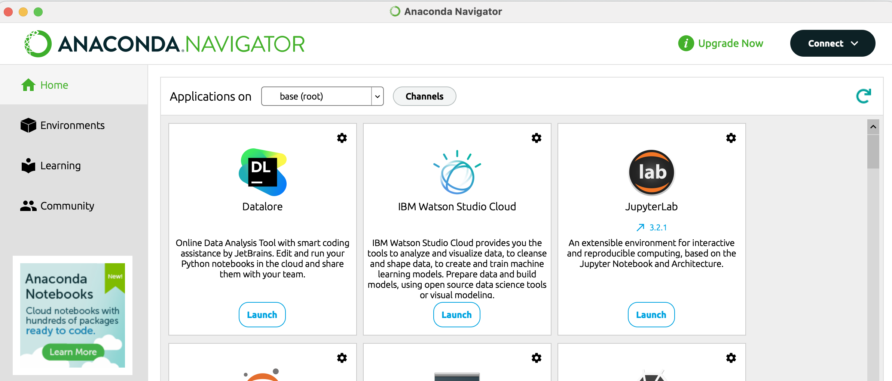
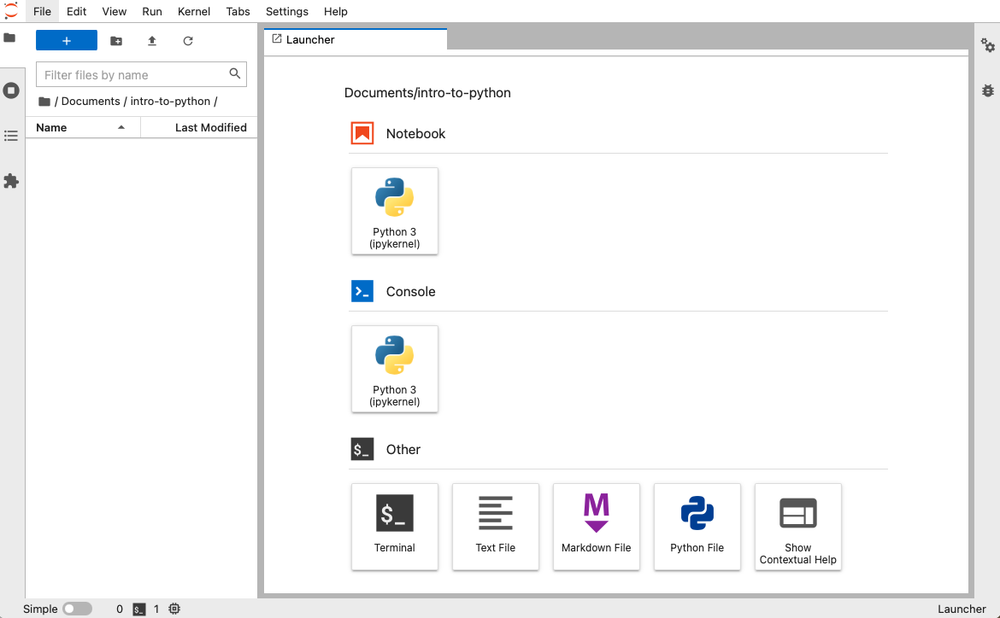

## Introduction to JupyterLab

Jupyterlab is a web-based user interface to run Python code and is not a traditional Integrated Development Environment (IDE) where you create scripts via some text editor and then submit directly to command line. JupyterLab has several advantages, including being able to run code in chunks, annotating code with links, and displaying figures right next to code! For this reason, JupyterLab is a robust tool for script development/data analysis. 

## Downloading Anaconda/JupyterLab

To download JupyterLab you will need to download the Anaconda distrubution of conda:

!!! abstract "[Download Anaconda/JupyterLab](https://www.anaconda.com/download)"

Follow the instructions to download Anaconda. Once downloaded, open the Anaconda-Navigator and click `Install` in the JupyterLab tab. When it is ready you will see a launch button which you will click:

!!! info "Open JupyterLab"

    

When you open JupyterLab you will notice:

- **Left Sidebar**: containing your file browser, list of running kernels/terminals, table of contents, extension manager
- **Main Work Area**: containing options for file/window types to open (ipykernels, terminal environments, text files, markdown files, and python files)

!!! info "JupyterLab Layout"

    

We are going to start by opening up a `.ipynb` file by clicking `Notebook Python 3 (ipykernel)`. These are not python scripts, but notebook files that contain code but also text, links and images. These files can easily be converted to a python script (file ending in `.py`) by going to:

- `File`
- `Download as`
- `Python (.py)`

For now let's work in the Jupyter notebook (`.ipynb` file)!

## Code Vs. Markdown

You will notice when you open up your notebook that you are working in blocks:

!!! info "Code/Markdown Blocks"

    

These blocks can either be:

- **raw blocks:** raw data that can be converted into HTML/Latex formats
- **code blocks:** python code that can be run in chunks
- **markdown blocks:** a plain text format that can render links, lists, and images like what you might find on a website

Here we will focus on code blocks to run chunks of python code, and markdown blocks which can add in images, links, etc. to annotate our code.

## Markdown Basics

**markdown code:**

```md
- list item 1
- list item 2
```
**output:**
- list item 1
- list item 2

**markdown code:**

```md
1. numbered list item 1
2. numbered list item 2
```
**output:**
1. numbered list item 1
2. numbered list item 2

**markdown code:**

```md
# Level 1 Heading
## Level 2 Heading
```
**output:**
# Level 1 Heading
## Level 2 Heading

**markdown code:**

```md
[google link](https://www.google.com/)
```
**output:**
[google link](https://www.google.com/)

Now that we have a basic understanding of markdown, let's create some annotations. In your first code block change the type to markdown and enter:

```md
# Introduction to Python 

Here are a few helpful links to get started:

- [Python Cheatsheet](https://www.pythoncheatsheet.org/cheatsheet/basics)
- [JupyterLab Documentation](https://jupyterlab.readthedocs.io/en/stable/)
```

Now hit either the play button at the top of the screen or hit `Shift + Enter` to run the block:

!!! info "Running A Markdown Block"

    
