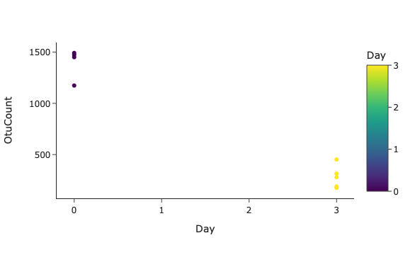
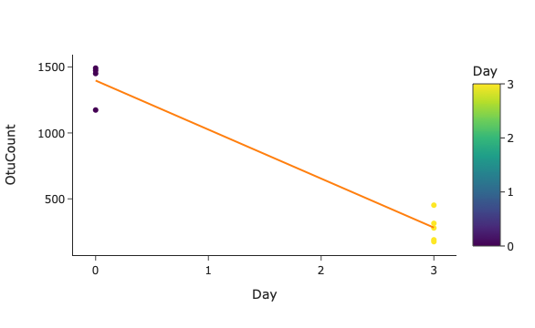
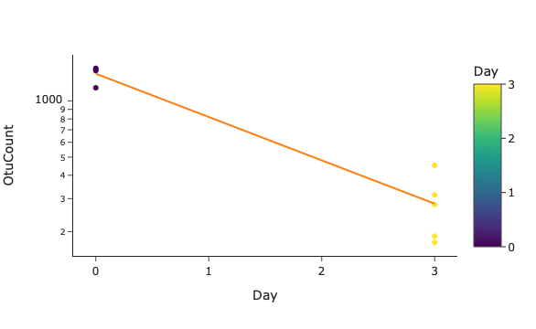
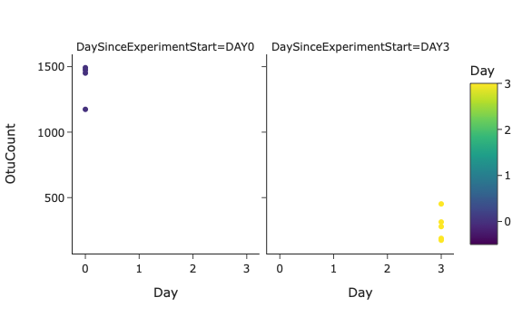
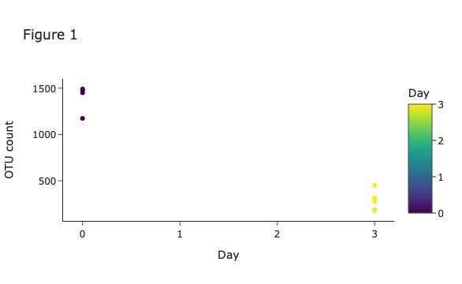

## Plotting with Plotly

While there are other plotting libraries, we will focus on `plotly` for the following reasons:

- has the ability to zoom 
- images can be downloaded as `png` files
- select features can highlight features of the plot

## Basic Plot

Let's make a scatterplot:

```py
import plotly.express as px
fig = px.scatter(df,                      # the data we are using
                 x="Day",                 # x axis data
                 y="OtuCount",            # y axis data
                 color='Day',             # how to color our data
                 template="simple_white") # what theme we would like
fig.show()
```

!!! info "Scatterplot"

    

## Adding A TrendLine

We can add a trend line as well:

```py
import plotly.express as px
fig = px.scatter(df,
                 x="Day",
                 y="OtuCount",
                 color='Day',
                 template="simple_white",
                 trendline="ols")         # add in a trend line
fig.show()
```

!!! info "Adding A Trend Line"

    

## Scaling

Now if one of your axes spans multiple magnitudes you can scale your data using the `log_x` or `log_y` arguements:

```py
fig = px.scatter(df,                                   
                 x="Day",                              
                 y="OtuCount",                          
                 color='Day',                           
                 template="simple_white",
                 trendline="ols",
                 log_y = True)             # scale y axis
fig.show()
```

!!! info "Scaling"

    

## Panels

Sometimes it is useful to separate data by some variable and create panels. We can easily do this by specifying the `facet_row` or `facet_col` arguements - where plots are stacked one on top of the other or side-by-side, respectively:

```py
fig = px.scatter(df,                                   
                 x="Day",                              
                 y="OtuCount",                          
                 color='Day',                           
                 template="simple_white",
                 facet_col = "DaySinceExperimentStart") # split plots by variable
fig.show()
```

!!! info "Adding Panels"

    

# Modifying Text

To modify text we can use the `labels` and `title` option:

```py
fig = px.scatter(df,                                   
                 x="Day",                              
                 y="OtuCount",                          
                 color='Day',                           
                 template="simple_white",
                 labels={                        
                     "OtuCount": "OTU count"     # add in a space and capitalize
                 },
                 title = "Figure 1")             # add in figure title
fig.show()
```

!!! info "Modifying Text"

    

!!! tip
    For more plots and plot customization options, checkout the [Plotly Graphing Library Page](https://plotly.com/python/) for more information
    

## References

1. [Data Analysis and Visualization in Python for Ecologists](https://datacarpentry.org/python-ecology-lesson/index.html)
