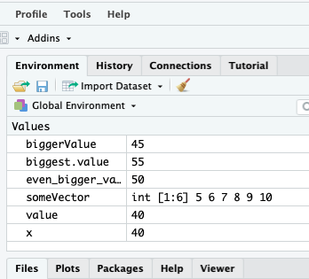
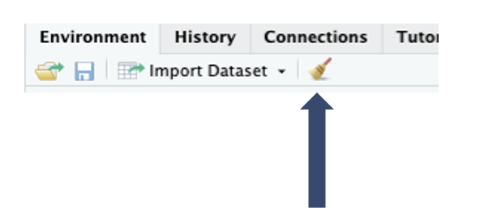

# Data Types, Variables & Vectors

## Data Types

In R we can use a few different types of types of data:

- **numeric** - numeric values that can contain whole numbers and decimals
- **character** - text value that is made a text value by adding quotes. So for example 1 2 3 is a numeric data, but "1" "2" "3" is character data
- **integer** - limited to just whole numbers, but will take up less memory than numeric data. We can specify an integer by adding L to a number (e.g. 1L or 3L)
- **logical** - These are boolean values so TRUE/T or FALSE/F.
- **complex** - complex number such as 1+6i
    
    
## Variables

We can store these data in terms called **variables**. In R, values can be assigned to words using the `<-` operator:

```R
x <- 35 
x
```

!!! info "output"

    ```
    [1] 35
    ```

Here we see that we assigned the value of 35 to the `x`!

```R
x <- 40 # changing value to 40
x
```


!!! info "output"

    ```
    [1] 40
    ```

You'll notice that we initially assigned `x` to a value of `35` and then updated value to `40`. This is important to keep in mind because the last value assigned to `x` will be kept. You'll also notice that we add words after the `#` symobl. This is what is known as a comment, where everything after the `#` is not registered as R code. Commenting is immensely valuable for giving your code context so that you and whoever else reads it knows the purpose of a given chunk of code. 

Variables can also have a combination lowercase letters, uppercase letters, underscores and periods:

```R
value <- 40
biggerValue <- 45
even_bigger_value <- 50
biggest.value <- 55
```

```R
value
biggerValue
even_bigger_value
biggest.value
```

!!! info "output"

    ```
    [1] 40
    [1] 45
    [1] 50
    [1] 55
    ```


!!! note

    Take note that the spelling needs to be consistent to call the variable correctly.

## Environment

As you may have noticed we have been assigning variables and they have been added to your `Environment` window:



If you would like to declutter your environment, you have a few options:

- You can use the `rm()` function to remove which ever variables you'd like. To remove more than one just put a comma between variable names.
- You can clear **all variables** by clicking the broom icon:




!!! warning

    Be careful when removing variables, especially if these values took a long time to generate!
     

## Vectors

We can also assign a series of values in a specific order to a variable to create what is called a **vector**:

```R
someVector <- 5:10
someVector
```

!!! info "output"

    ```
    [1]  5  6  7  8  9 10
    ```

Just a note on vectors - when we create vectors of other data types, we typically need to put our set in the following format:

```R
character_vec <- c("a","b","c")
```

Here we see that values are separated by commaas and in between `c()`. We can select values in a vector we need to use a few different comparison operators:

- **Equals:** `==`
- **Does Not Equal:** `!=`
- **Less Than Or Equal** `<=`
- **Greater Than Or Equal** `>=`
- **Greater Than** `>`
- **Less Than** `<`

Let's try using some!

```R
someVector[someVector == 10] # Elements which are equal to 10
```

!!! info "output"

    ```
    [1] 10
    ```

```R
someVector[someVector < 7] # All elements less than seven
```


!!! info "output"

    ```
    [1] 5 6
    ```
    
```R
someVector[-4] # All but the fourth value
```

!!! info "output"

    ```
    [1]  5  6  7  9 10
    ```
    
```R    
someVector[2:4] # Elements two to four
```

!!! info "output"

    ```
    [1] 6 7 8
    ```
    
```R 
someVector[c(1, 5)] # Elements one and five
```

!!! info "output"

    ```
    [1] 5 9
    ```

```R
someVector[someVector %in% c(5,8,9)] # Elements in the set 5,8,9
```

!!! info "output"

    ```
    [1] 5 8 9
    ```

We can also give our vector names per value:

```R
names(someVector) <- c("a","b","c","d","e","f")
someVector
```

!!! info "output"

    ```
    a  b  c  d  e  f 
    5  6  7  8  9 10 
    ```
    
We see that each value now has a name, `a-f`. We can refer to values by this name:

```R
someVector["c"]
```

!!! info "output"

    ```
    c 
    7 
    ```
    
## Data Type Conversion

We can convert between data types with a few functions:

- `as.logical` - converts to boolean values
- `as.numeric` - converts to numeric values
- `as.character`  - converts to character values
- `as.factor` - converts to factor values

Here we mentions factors which are used for data with levels. Think of small, medium and large. This order can be specified when you factor data with the `factor` function:

```R
factor_var <- factor(c("a","b","c"), levels=c("a","b","c"))
factor_var
```

!!! info "output"

    ```R
    [1] a b c
    Levels: a b c
    ```
    
In the output we see that our data now has `Levels` which specify the desired order. 

