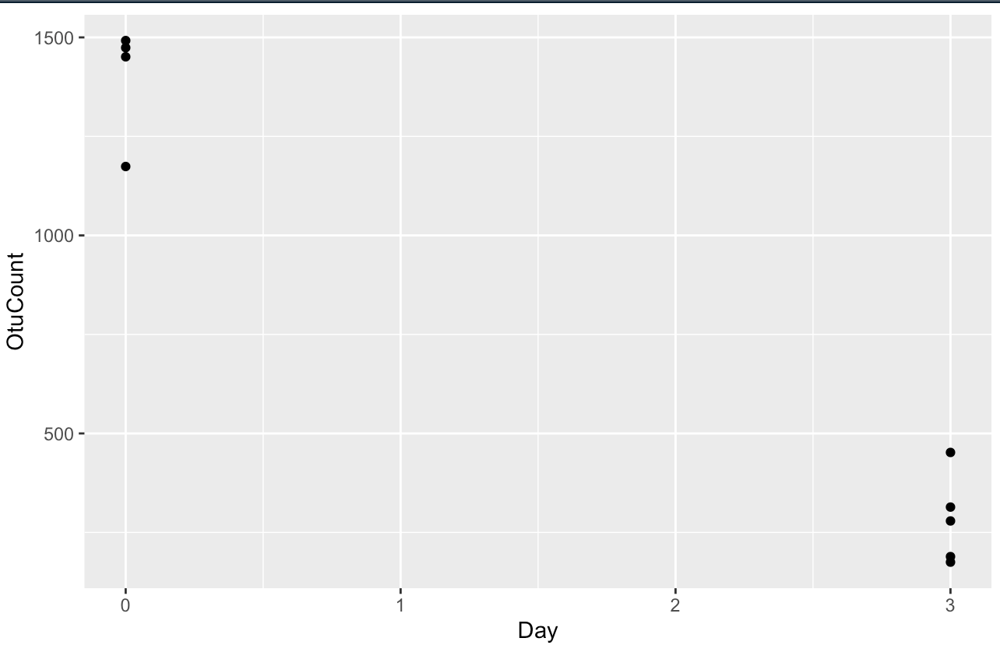
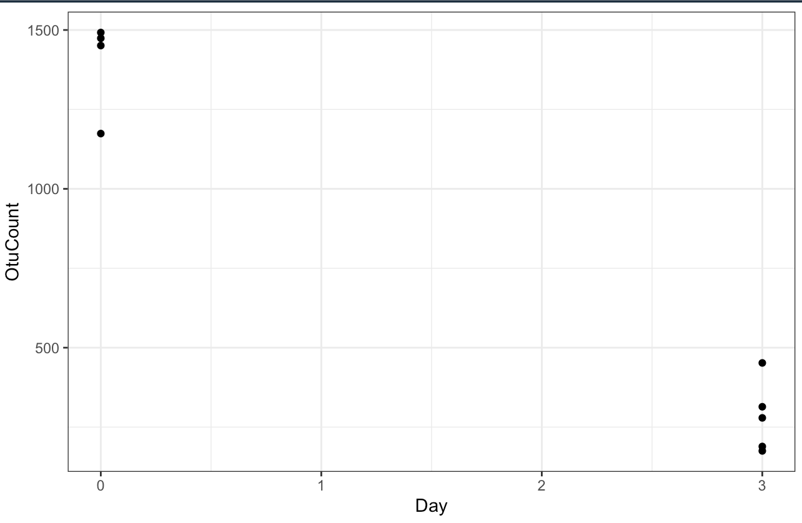
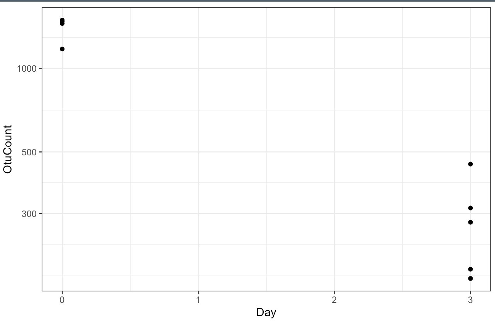
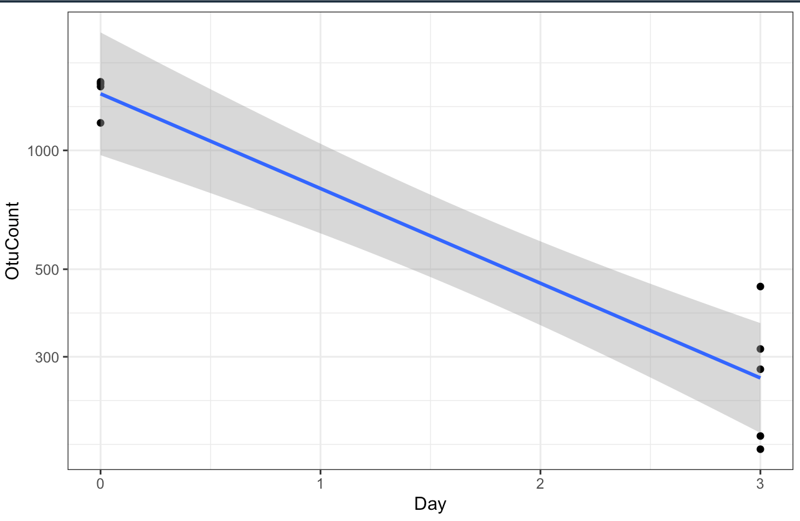
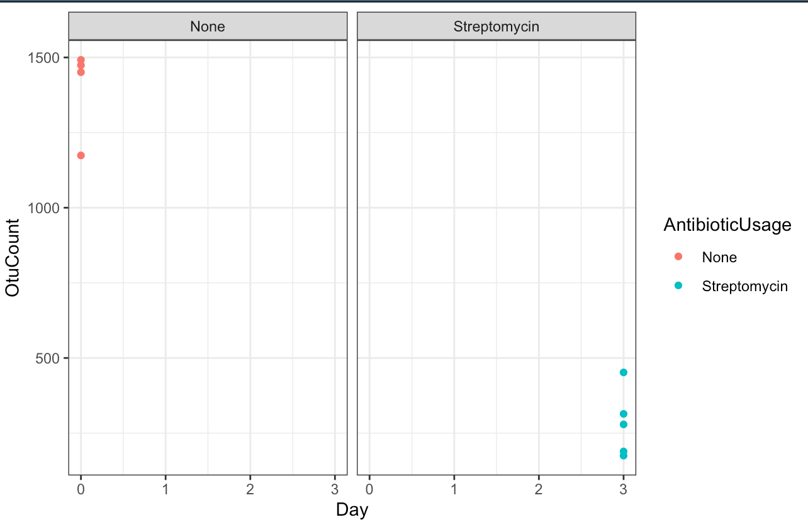
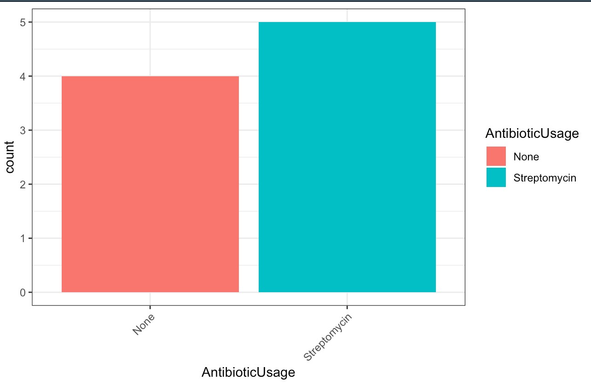
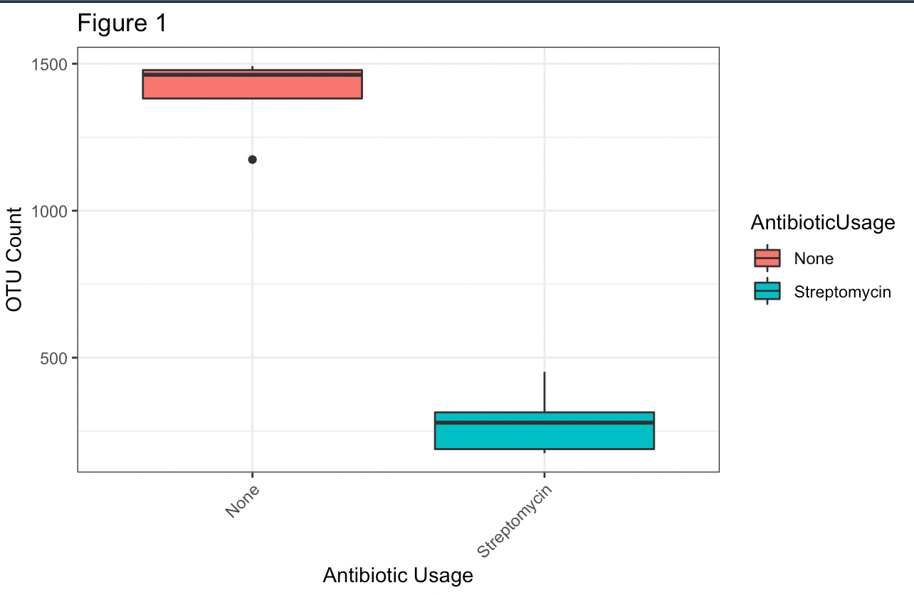

## Plotting With ggplot2

While it is possible to use the base plotting system in R, we are going to focus on using the `ggplot2` library to create plots due to it's widespread use in scientific figure generation and the versitility of the package. The basic formula for creating a plot is as such:

```R
library(ggplot2)

ggplot(data = meta, mapping = aes(x = Day, y = OtuCount)) +    # specify what data you are using and what your x and y columns are
  geom_point()   # what type of plot do you want to make? here we make a scatterplot
```

!!! info "Basic Scatterplot"

    

While we will go through a few plot types in this topic note, we reccomend you check out the [R Graph Gallery](https://r-graph-gallery.com) for a complete list of possible plots and how to make them using the `ggplot2` library.

## Themes

You are not just limited to a grey background theme when plotting with `ggplot2`. A poplular theme used in scientific figures is the dark-on-light theme:

```R
ggplot(data = meta, mapping = aes(x = Day, y = OtuCount)) +
  geom_point()+
  theme_bw()
```

!!! info "Basic Scatterplot - With Theme"

    

!!! tip
    For a complete list of themes, visit the [Complete ggplot2 Themes page](https://ggplot2.tidyverse.org/reference/ggtheme.html)

## Scaling

Oftentimes your data will span mulitple magnitudes and this can result in an awkward distribution of data. We can scale either your x or y axes using a log scale to remedy this:

```R
ggplot(data = meta, mapping = aes(x = Day, y = OtuCount)) +
  geom_point()+
  theme_bw()+
  scale_y_log10()
```

!!! info "Basic Scatterplot -  With Log Scaling"

    

## Relationships

When plotting two numeric data columns against one another, it might be useful to have a representation of their relationship. Here we show how to add a best fit line:

```R
ggplot(data = meta, mapping = aes(x = Day, y = OtuCount)) +
  geom_point()+
  theme_bw() +
  scale_y_log10() +
  geom_smooth(method="lm")
```

!!! info "Basic Scatterplot - With Regression Line"

    

## Panels and Colors

Panels and colors are an important cue to highlight differences in your data:

```R
ggplot(data = meta, 
       mapping = aes(x = Day, y = OtuCount,color = AntibioticUsage)) +    # color by antibiotic usage
  geom_point()+
  facet_wrap(~AntibioticUsage)+    # create different panels for different types of antibiotic usage
  theme_bw()                   
```

!!! info "Basic Scatterplot - With Pannels and Colors"

    

## Modifying Text

To modify your text style you can leverage the `theme()` function:

```R
ggplot(data = meta, mapping = aes(x = AntibioticUsage,fill = AntibioticUsage)) +
  geom_bar()+
  theme_bw() +
  theme(axis.text.x = element_text(angle = 45,hjust = 1)) # angle the text by 45 degrees and move the text down by 1 point
```

!!! info "Basic Barplot - With The Text Modified"

    

You can also modify the x label, y label, title, and title of the legend:

```R
ggplot(data = meta, mapping = aes(x = AntibioticUsage, y = OtuCount,fill= AntibioticUsage)) +
  geom_boxplot()+
  theme_bw() +
  theme(axis.text.x = element_text(angle = 45,hjust = 1)) +
  labs(
    x = "Antibiotic Usage",      # x axis title
    y = "OTU Count",             # y axis title
    title = "Figure 1",          # main title of figure
    color = "Antibiotic Usage"   # title of legend
  )
```

!!! info "Basic Boxplot - With Plot Labels Changed"

    


## References

1. [R for Reproducible Scientific Analysis](https://swcarpentry.github.io/r-novice-gapminder/)
2. [Base R Cheat Sheet](https://iqss.github.io/dss-workshops/R/Rintro/base-r-cheat-sheet.pdf)
