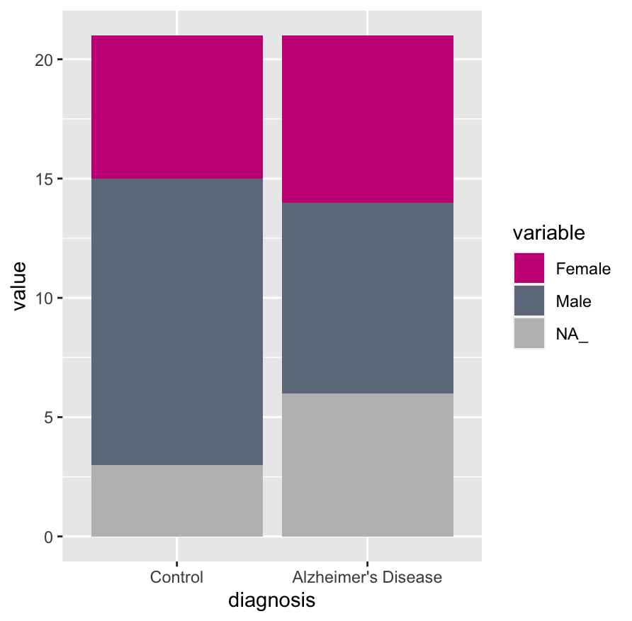
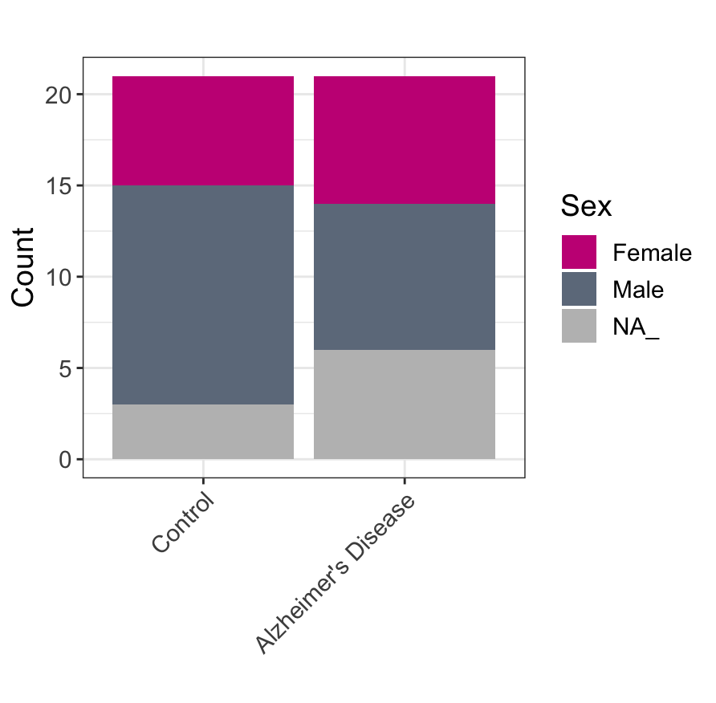
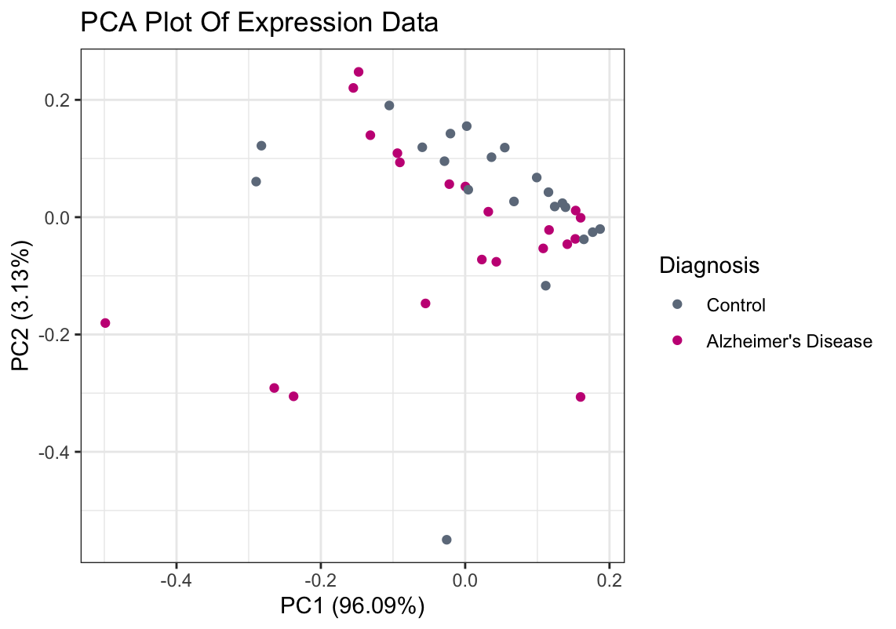
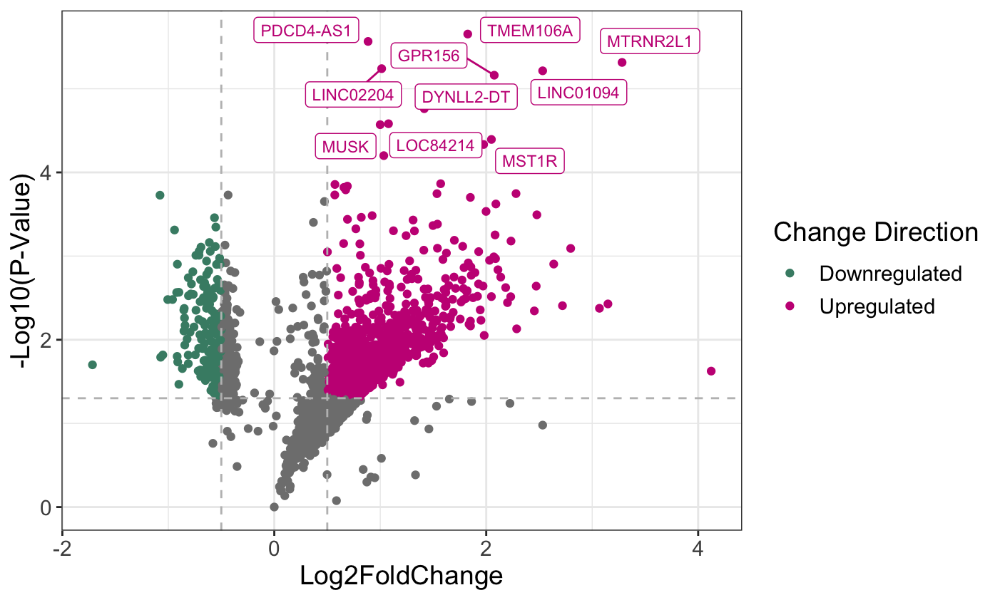
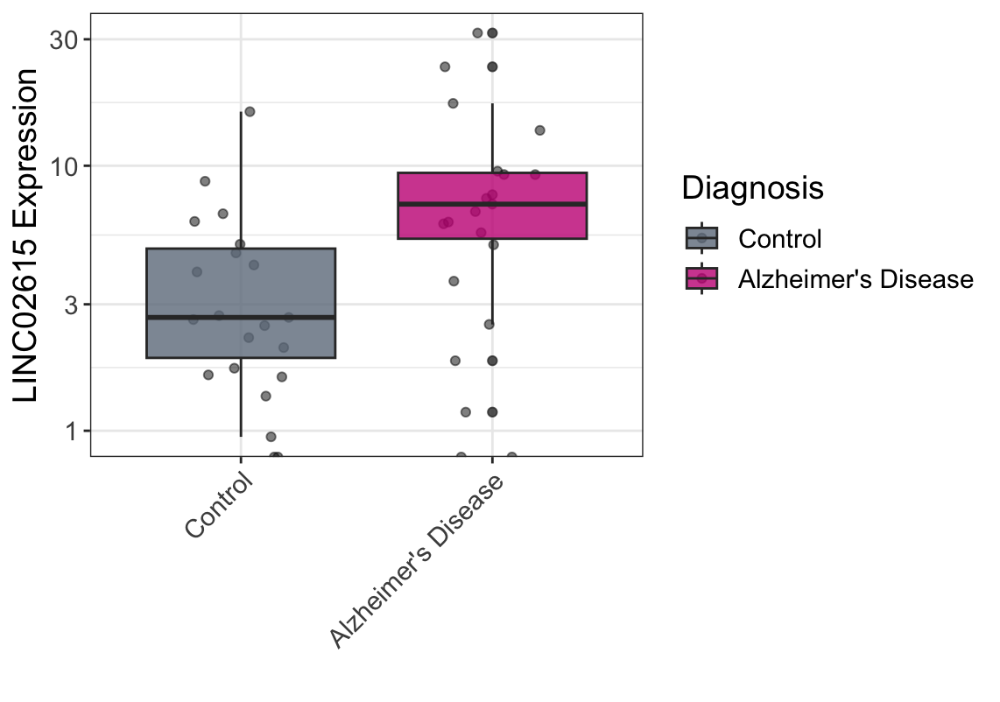
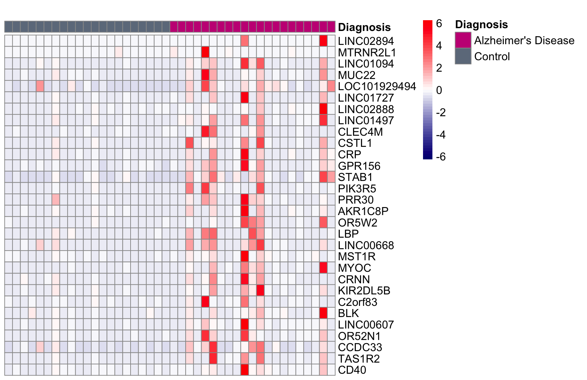
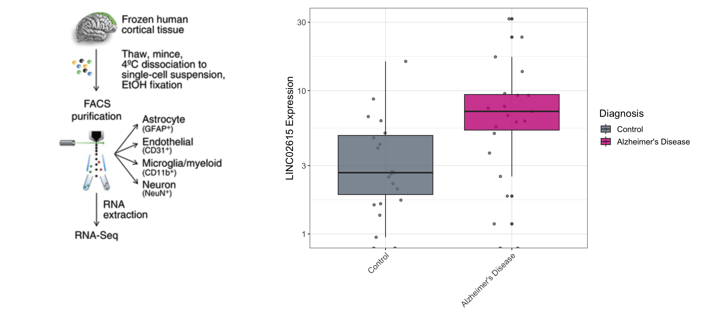
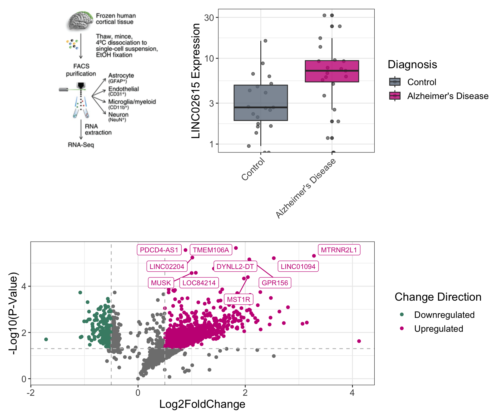
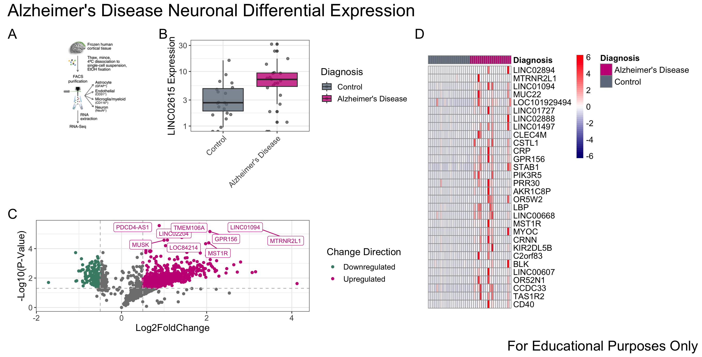

## Creating a Barplot

Now do we know how to manipulate data frames we are going to use the `ggplot` package to plot our different meta data categories we will start by using the `tabyl` function to tabulate diagnosis by sex and then melt to ensure that categorical variables are in one separate columns while all values are in one column:

```{r,message=F,warning=F}
# tabulate diagnosis by sex and ensure categorical variables are in separate columns:
diagnosis_sex <- tabyl(merged,diagnosis,Sex) %>%
  reshape2::melt()
diagnosis_sex
```

!!! info "output"

    ```
                    diagnosis variable value
    1             Control   Female     6
    2 Alzheimer's Disease   Female     7
    3             Control     Male    12
    4 Alzheimer's Disease     Male     8
    5             Control      NA_     3
    6 Alzheimer's Disease      NA_     6
    ```
    
 Here we see that each variable has it's own column - this is necessary for plotting in ggplot:
 
 ```
 ggplot(diagnosis_sex,         # data frame to use for plotting
       aes(x=diagnosis,       # set the x axis
           y=value,           # set the y axis
           fill=variable))+   # what column do we fill the bars by
  geom_bar(stat="identity")   # keep the count values as they are
 ```
 
!!! info "Bar Plot"

    

## Fixing ggplot Colors

Above we created a ggplot bar plot! however, it isn't publication worth yet for that we will need to play around with the formatting let's change the colors first!


```R
ggplot(diagnosis_sex,            # data frame to use for plotting
       aes(x=diagnosis,          # set the x axis
           y=value,              # set the y axis
           fill=variable))+      # what column do we fill the bars by
  geom_bar(stat="identity")+     # keep the count values as they are
  scale_fill_manual(values = c(
    c(                           # modify the colors manually
      "Female"="mediumvioletred",
      "Male"="lightsteelblue4",
      "NA_"="grey")
  ))
```

!!! info "Bar Plot With Colors"

    
    
## Fixing ggplot themes

Now let's change the theme of the plot! A plot's theme is essentially the background styling. A common theme used in publications is the black and white theme:

```R
ggplot(diagnosis_sex,            # data frame to use for plotting
       aes(x=diagnosis,          # set the x axis
           y=value,              # set the y axis
           fill=variable))+      # what column do we fill the bars by
  geom_bar(stat="identity")+     # keep the count values as they are
  scale_fill_manual(values = c(
    c(                           # modify the colors manually
      "Female"="mediumvioletred",
      "Male"="lightsteelblue4",
      "NA_"="grey")
  ))+
  theme_bw()                     # set the black and white theme   
```

!!! info "Bar Plot With Themes"

    
    

## Fixing ggplot Labels

Now let's change the labels of the plot! We will rotate the x axis labels, change the font size, and change the label text!

```R
barplot <- ggplot(
  diagnosis_sex,                        # data frame to use for plotting
       aes(x=diagnosis,                 # set the x axis
           y=value,                     # set the y axis
           fill=variable))+             # what column do we fill the bars by
  geom_bar(stat="identity")+            # keep the count values as they are
  scale_fill_manual(values = c(
    c(                                  # modify the colors manually
      "Female"="mediumvioletred",
      "Male"="lightsteelblue4",
      "NA_"="grey")
  ))+
  theme_bw()+                           # set the black and white theme  
  theme(
    axis.text.x = element_text(         # reference just the axis x text
      angle = 45,                       # rotate the text 45 degrees
      hjust = 1                         # move the text horizontally down by one
    ),
    text =element_text(size = 14)       # increase base text size to 14
  )+
  labs(
    x="",                               # change x axis title to no text
    y="Count",                          # change y axis title 
    fill="Sex",                         # change legend title
    title = ""                          # add a figure title
  )
barplot
```

!!! info "Bar Plot With Themes"

    
    
    
## Creating A PCA Plot

PCA or Principal Component Analysis is a way of visualizing the variation in high dimensional data in just a few dimensions. For more information, [check out our tutorial on PCA](../../machine_learning/unsupervised/dimension-reduction.md). Let's examine the variation in our gene expression data and color by disease status:

```R
# run pca on just our counts data (exclude meta data)
pca_res <- prcomp(merged %>%                  # data frame to use
                    select(-names(.)[1:7]))   # unselecting meta data columns

# create a pca plot colored by smoking status using the autoplot function
# and modify it using our ggplot modifiers from above!
pca_plot <- autoplot(pca_res,           # the pca object
         data = merged,                 # the whole data frame (with meta data)
         colour = "diagnosis")+         # what variable to color by
  theme_bw()+                           # set the theme to black & white
  scale_color_manual(                   
    values=c(                           # modify the colors manually
      "Alzheimer's Disease"="mediumvioletred",
      "Control"="lightsteelblue4"))+
  labs(
    color="Diagnosis",                  # change the legend title
    title="PCA Plot Of Expression Data" # chage the figure title
  )
pca_plot
```


!!! info "PCA Plot"

    


## Running DESeq2

Here we want to cover how to plot differential expression results without going into too much detail. Here we provide a wrapper to run DESeq2 on our counts/meta data:

```R
runDESeq2 <- function(meta_data,
                      counts_data,
                      formula){
  # take a counts data frame with the genes as rownames
  # and the patients as column names and confirm: data is an integer
  # and that the gene name is the first column
  counts_data <- data.frame(gene=rownames(counts_data)) %>%
    cbind.data.frame(sapply(counts_data,as.integer)) %>%
    mutate(tmp_col=gene) %>%
    column_to_rownames("tmp_col")
  # create the deseq object
  dds <- DESeqDataSetFromMatrix(countData=counts_data, 
                                colData=meta_data, 
                                design=formula,
                                tidy = TRUE)
  # run deseq
  dds <- DESeq(dds)
  # shrink log fold changes
  res <- lfcShrink(dds, coef=2, type="apeglm")
  # get/return results data frame
  res <- data.frame(res)
  return(list(
    dds=dds,
    res=res
  ))
}
```

Let's run DESeq2 on our data and check out the results:

```R
# now let's run DESeq2 on our data!
dds_res <- runDESeq2(
  meta_data = meta_filt,
  counts_data = counts_filt ,
  formula = as.formula("~ diagnosis"))

res <- dds_res$res
# let's take a look at the results
head(res)
```

!!! info "DESeq2 Results"

    ```
               baseMean log2FoldChange     lfcSE      pvalue       padj
    AKT3     490.709649     -0.4670004 0.2361901 0.030085339 0.08116548
    NR2E3      9.598653      0.6037522 0.2356439 0.004889092 0.05707112
    NAALADL1   1.999027      0.7468250 0.5435370 0.042450489 0.09012843
    SIGLEC14   2.625559      0.3236496 0.5752871 0.110457222 0.13128830
    MIR708     1.504679      0.5881716 0.5340170 0.092049083 0.12021453
    NAV2-AS6  27.774062      0.2249761 0.1803118 0.184228395 0.19262298
    ```
    
## Cleaning Up Results

Above we have the DESeq2 results for our data. However, it is nice to include columns for the change direction (i.e. up or down regulated) and whether or not the results are significant. Let's add that information in!

```{r,message=F,warning=F}
# add columns for change direction, modify this column so that only genes
# with a p-value below 0.05 are colored, drop any genes with na 
# fold changes/pvalues and add in a gene column
res <- res %>%
  mutate(change_direction=ifelse(
    log2FoldChange>0 ,
    "Upregulated",
    "Downregulated"
  )) %>%
  mutate(change_direction=ifelse(
    pvalue<0.05 &
      abs(log2FoldChange) > 0.5,
    change_direction,
    "Not Significant"
  )) %>%
  drop_na()

# isolate top genes
top_genes <- res %>%
  filter(change_direction != "Not Significant") %>%
  arrange(pvalue) %>%
  slice_head(n=10) %>%
  rownames(.)

# add in column for top genes
res <- res %>%
  mutate(top_genes=ifelse(
    rownames(.) %in% top_genes,
    rownames(.),
    NA
  ))


# now let's take a look at the new columns!
head(res)
```

!!! info "output"

    ```
               baseMean log2FoldChange     lfcSE      pvalue       padj change_direction top_genes
    AKT3     490.709649     -0.4670004 0.2361901 0.030085339 0.08116548  Not Significant      <NA>
    NR2E3      9.598653      0.6037522 0.2356439 0.004889092 0.05707112      Upregulated      <NA>
    NAALADL1   1.999027      0.7468250 0.5435370 0.042450489 0.09012843      Upregulated      <NA>
    SIGLEC14   2.625559      0.3236496 0.5752871 0.110457222 0.13128830  Not Significant      <NA>
    MIR708     1.504679      0.5881716 0.5340170 0.092049083 0.12021453  Not Significant      <NA>
    NAV2-AS6  27.774062      0.2249761 0.1803118 0.184228395 0.19262298  Not Significant      <NA>
    ```
    
## Create a Volcano Plot

A popular way to visualize differential expression results is a volcano plot or a plot of log2 fold change versus the -log10 of the p-value where genes towards the top are more significant:


!!! info "Volcano Plot"

    
    
## Isolate Normalized Expression Data

DESeq2 normalizes your expression data as such if we intend to plot expression data we will need to use this expression data instead:

```R
# extract normalized data from deseq results
counts_norm <- counts(dds_res$dds, normalized=TRUE) %>%
  t() %>%
  data.frame() %>%
  rownames_to_column("patient_id")

# ensure patients match
meta_patient_to_col <- meta_filt %>%
  rownames_to_column("patient_id")

# merge our data
merged_norm <- meta_patient_to_col %>%
  inner_join(
    .,
    counts_norm,
    by="patient_id"
  )
```

## Create a Expression Box Plots

Often times we may want to visualize the expression of our top differentially expressed genes. We can do this using a box plot!

```R
exp_plot <- ggplot(merged_norm,         # data frame to use                     
       aes(
         x=diagnosis,                   # x axis
         y=LINC02615,                   # y axis
         fill=diagnosis                 # what to fill by
       ))+
  geom_jitter(alpha = .5,width = .2)+
  geom_boxplot(alpha = 0.8)+
  scale_y_log10()+
  theme_bw()+
  scale_fill_manual(values = c(
    c(                                  # modify the colors manually
      "Alzheimer's Disease"="mediumvioletred",
      "Control"="lightsteelblue4")
  )) +
  theme(
    axis.text.x = element_text(         # reference just the axis x text
      angle = 45,                       # rotate the text 45 degrees
      hjust = 1                         # move the text horizontally down by one
    ),
    text =element_text(size = 14)       # increase base text size to 14
  )+
  labs(
    x="",                               # change x axis title to no text
    y="LINC02615 Expression",           # change y axis title 
    fill="Diagnosis",                   # change legend title
  )

exp_plot
```

!!! info "Expression Plot"

    
    
## Creating A Heatmap

Along with our gene expression box plots, it is often useful to create a heatmap of our top differentially expressed genes. We will create one using the pheatmap function!

```R
# isolate the top 15 degs
top_15 <- res %>% 
  filter(pvalue <0.05)%>%
  arrange(desc(log2FoldChange)) %>% 
  head(30) %>%
  rownames(.)

# filter DESeq2 normalized counts to select top 15 genes
top_15_counts <- counts(dds_res$dds, normalized=TRUE) %>%
  data.frame() %>%
  filter(rownames(.) %in% top_15) 

# set the colors for our heatmeap annotation
anot_colors <- list(Diagnosis=c(                               
  "Alzheimer's Disease"="mediumvioletred",
  "Control"="lightsteelblue4"))

# select dianosis and make the patient id the rownames
anot_col <- merged_norm %>%
  column_to_rownames("patient_id") %>%
  select(c(diagnosis)) %>%
  arrange(diagnosis) %>%
  dplyr::rename("Diagnosis" = "diagnosis")

heat <- pheatmap::pheatmap(                     # heatmap function
  top_15_counts[,rownames(anot_col)],           # data to input 
  color=colorRampPalette(                       # set specific color range
    c("navy", "white", "red"))(50),
  scale = "row",                                # scale by row
  fontsize = 12,                                # set the font size
  annotation_col =  anot_col,                   # set the annotation variable
  annotation_colors = anot_colors,              # set annotation variables
  cluster_cols = F,                             # do not cluster by column
  cluster_rows = F,                             # do not cluster by row
  show_colnames = F,                            # do not show column names
  main="")                                      # set a main title
heat <- as.ggplot(heat)
```

!!! info "Heatmap"

    
    
## Using Images in ggplot

Images can also be insterted into a ggplot let's add an image that describes the study design:


```R
# read in image
img <- readPNG("../data/ad_overview.png", native = TRUE)
# convert to a grob
img <- rasterGrob(img, interpolate=TRUE)
# add grob to a ggplot 
gg_img <- ggplot()+annotation_custom(img, xmin=-Inf, xmax=Inf, ymin=-Inf, ymax=Inf)+theme_void()
gg_img
```

!!! info "Study Design Overview"

    

## Combining Plots

### Side By Side

We can now combine these into a combined figure with the patchwork package!

```R
# use "|" to set plot side by side
top_row <- gg_img|exp_plot
top_row
```

!!! info "Top Row Of Figure"

    
    
### Bottom/Top Rows

```R
# define a top and bottom row using "/"
left_side <- top_row/volcano_plot
left_side
```


!!! info "Left Side Of Figure"

    
    
### Putting It All Together

```R
# define right side of figure
right_side <- heat

# combine left and right sides
combined <- left_side | right_side

combined
```

!!! info "Combined Figure"

    

### Adding Labels

```R
# now add at title, caption, and annotation levels starting at A
combined_with_labels <- combined+
  plot_annotation(
    tag_levels = 'A',
    title = "Alzheimer's Disease Neuronal Differential Expression",
    caption = "For Educational Purposes Only"
  ) &
  theme(plot.tag = element_text(size = 20),
        plot.title = element_text(size = 25),
        plot.caption = element_text(size = 20))

combined_with_labels
```


!!! info "Combined Figure"

    
    
## Saving Figures

```R
# we can save our new ggplot with the ggsave function:
ggsave(
  filename = "./results/combined_figures.png",
  plot = combined_with_labels
)
```
